👋 Hey, I'm Dev Nijhawan

  

  

  
  
  

  
  
  

🧠 WHO AM I?

I don't just want to build models — I want to build intelligence into useful products.

I'm Dev Nijhawan, an AI/ML Engineer interested in Machine Learning, Computer Vision, Generative AI, Python, and AI-powered applications.

I enjoy taking a real problem, understanding the data behind it, experimenting with models and tools, and turning the result into a working system.

                REAL PROBLEM
                     │
                     ▼
               🔎 Understand
                     │
                     ▼
              📊 Data / Signals
                     │
                     ▼
              🧠 ML / AI Logic
                     │
           ┌─────────┴─────────┐
           ▼                   ▼
     👁️ Computer Vision   ✨ Generative AI
           └─────────┬─────────┘
                     ▼
              🔗 AI Pipeline
                     │
                     ▼
              🚀 Useful Product

My mindset: Curious → Experiment → Build → Test → Improve → Ship

🤖 MY AI / ML STACK

🧠 AI / Machine Learning

  

  
  
  
  

📊 Data & Python

  
  
  

👁️ Computer Vision & Document AI

  
  
  

✨ Generative AI & APIs

  
  
  
  

🛠️ Development Tools

  

🚀 FEATURED AI PROJECTS

<table>
<tr>
<td width="50%">

🪪 VeritasID

AI-assisted Identity & Document Screening

A security-focused prototype that combines:

OCR / text extraction

Field consistency checks

QR validation

Image-forensics signals

Risk scoring

Explainable screening output

Stack: Python FastAPI Tesseract OpenCV

</td>
<td width="50%">

🌦️ WeatherGPT

AI-Powered Weather Assistant

A conversational weather application that combines live weather information with an AI layer to produce useful, understandable guidance.

Stack: FastAPI Next.js Claude PostgreSQL

<a href="https://github.com/DevNijhawan/Weather-Ai">🔗 View repository</a>

</td>
</tr>
</table>

📈 GITHUB ACTIVITY

The activity card below is generated and committed by GitHub Actions in this profile repository, so it doesn't depend on a public third-party stats API at README load time.

  

🐍 CONTRIBUTION SNAKE

  <picture>
    <source media="(prefers-color-scheme: dark)" srcset="https://raw.githubusercontent.com/DevNijhawan/DevNijhawan/output/github-contribution-grid-snake-dark.svg" />
    <source media="(prefers-color-scheme: light)" srcset="https://raw.githubusercontent.com/DevNijhawan/DevNijhawan/output/github-contribution-grid-snake.svg" />
    
  </picture>

🎯 CURRENTLY LEARNING

🤖 Machine Learning
🧠 Deep Learning
👁️ Computer Vision
✨ Generative AI
📄 Document Intelligence
⚡ AI Inference & APIs
🧪 Model Experimentation
🚀 AI Product Development

🧬 MY BUILD LOOP

💡 IDEA
  ↓
🔎 PROBLEM
  ↓
📊 DATA
  ↓
🧠 MODEL / AI
  ↓
🧪 EXPERIMENT
  ↓
🔗 INTEGRATE
  ↓
🚀 SHIP
  ↓
♻️ IMPROVE

🏆 2026 MISSION

Goal

Status

🤖 Build stronger ML projects

🔄 In Progress

👁️ Improve Computer Vision skills

🔄 In Progress

✨ Explore Generative AI

🔄 In Progress

🪪 Build security-focused AI systems

🔄 In Progress

🏆 Participate in hackathons

🔄 In Progress

🚀 Turn ideas into useful products

🔥 Active

💻 DEVELOPER DNA

dev = {
    "name": "Dev Nijhawan",
    "role": "AI / ML Engineer",

    "focus": [
        "Machine Learning",
        "Computer Vision",
        "Generative AI",
        "Python",
        "AI Applications"
    ],

    "mindset": "Curious → Experiment → Build → Improve",

    "mission": "Build intelligent systems that solve real problems."
}

🌐 CONNECT WITH ME

  
  
  

  <i>“Don't just train models. Build intelligence people can use.”</i>

  

<b>⭐ Thanks for visiting my profile! ⭐</b>

